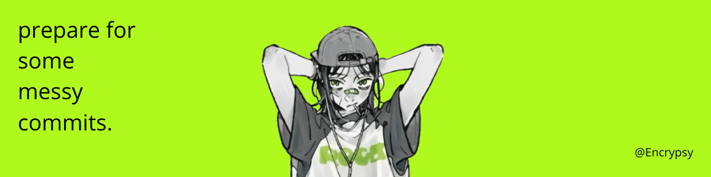

# Welcome to My Github Profile 👩🏻‍💻☕️

## 🛠️ Tech Stack

  
## 😁 Thanks to
 

 
   

 

## 🔥 Streak
 

### 🧠 Currently Working In

---

  

<picture>
  <source media="(prefers-color-scheme: dark)" srcset="https://raw.githubusercontent.com/Encrypsy/Encrypsy/output/pacman-contribution-graph-dark.svg">
  <source media="(prefers-color-scheme: light)" srcset="https://raw.githubusercontent.com/Encrypsy/Encrypsy/output/pacman-contribution-graph.svg">
  
</picture>

